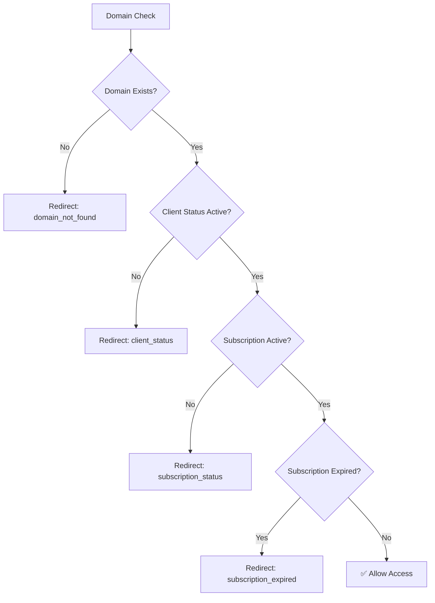

# Enhanced Domain Verification System

## Overview
Enhanced the real-time domain verification system to include comprehensive SAAS client validation: domain registration, client status, subscription status, and subscription expiry checks.

## ✅ Task Completed

**Request**: Include SAAS account status and subscription expiry checks in domain verification. Redirect to license setup if account is not active or subscription has expired.

## 🔧 Enhanced Verification Checks

### 1. Domain Registration Check *(Existing)*
- ✅ Verifies domain exists in `saasClients` database
- ✅ Supports exact and partial domain matching

### 2. Client Status Check *(NEW)*
- ✅ Verifies `client.status === 'active'`
- ✅ Blocks access if status is `suspended`, `cancelled`, etc.

### 3. Subscription Status Check *(NEW)*
- ✅ Verifies `client.subscriptionStatus === 'active'`  
- ✅ Blocks access if status is `expired`, `cancelled`, `suspended`, etc.

### 4. Subscription Expiry Check *(NEW)*
- ✅ Compares `client.subscriptionEndDate` with current date
- ✅ Blocks access if subscription has expired
- ✅ Handles lifetime subscriptions (null expiry date)

## 🔄 Enhanced Verification Flow



## 💻 Implementation Details

### Enhanced Domain Verification Logic
**File**: `/src/components/DomainVerificationMonitor.tsx`

```typescript
if (result.success && result.result?.exists && result.result.client) {
  const client = result.result.client;
  
  // Check 1: Client Status
  if (client.status !== 'active') {
    router.push(`/license-setup?error=client_status&status=${client.status}`);
    return;
  }
  
  // Check 2: Subscription Status  
  if (client.subscriptionStatus !== 'active') {
    router.push(`/license-setup?error=subscription_status&status=${client.subscriptionStatus}`);
    return;
  }
  
  // Check 3: Subscription Expiry
  if (client.subscriptionEndDate) {
    const expiryDate = new Date(client.subscriptionEndDate);
    const now = new Date();
    
    if (now > expiryDate) {
      router.push(`/license-setup?error=subscription_expired&expiry=${client.subscriptionEndDate}`);
      return;
    }
  }
  
  // All checks passed - allow access
  setDomainStatus('valid');
}
```

### Enhanced Error Handling
**File**: `/src/app/license-setup/page.tsx`

```typescript
const errorType = urlParams.get('error');
const status = urlParams.get('status');
const expiry = urlParams.get('expiry');

if (errorType === 'domain_not_found') {
  setError('This domain is not registered in the admin panel...');
} else if (errorType === 'client_status') {
  setError(`Your SAAS client account status is "${status}" and not active...`);
} else if (errorType === 'subscription_status') {
  setError(`Your subscription status is "${status}" and not active...`);
} else if (errorType === 'subscription_expired') {
  const expiryDate = expiry ? new Date(expiry).toLocaleDateString() : 'unknown';
  setError(`Your subscription expired on ${expiryDate}...`);
}
```

## 🚨 Access Restriction Scenarios

### 1. Domain Not Registered
**Trigger**: Domain doesn't exist in `saasClients` table
**Redirect**: `/license-setup?error=domain_not_found`
**Message**: "This domain is not registered in the admin panel. Please contact your administrator to register this domain as a SAAS client."

### 2. Client Status Not Active
**Trigger**: `client.status !== 'active'` (e.g., `suspended`, `cancelled`)
**Redirect**: `/license-setup?error=client_status&status=suspended`
**Message**: "Your SAAS client account status is 'suspended' and not active. Please contact your administrator to activate your account."

### 3. Subscription Status Not Active  
**Trigger**: `client.subscriptionStatus !== 'active'` (e.g., `expired`, `cancelled`)
**Redirect**: `/license-setup?error=subscription_status&status=expired`
**Message**: "Your subscription status is 'expired' and not active. Please contact your administrator to renew your subscription."

### 4. Subscription Expired
**Trigger**: `new Date() > new Date(client.subscriptionEndDate)`
**Redirect**: `/license-setup?error=subscription_expired&expiry=2024-01-15`
**Message**: "Your subscription expired on 1/15/2024. Please contact your administrator to renew your subscription."

## 🎨 Enhanced User Interface

### License Setup Error Messages

#### Domain Not Found
```
┌─────────────────────────────────────────────────┐
│ ❌ This domain is not registered in the admin   │
│    panel. Please contact your administrator    │
│    to register this domain as a SAAS client.   │
└─────────────────────────────────────────────────┘
```

#### Client Status Issue
```
┌─────────────────────────────────────────────────┐
│ ❌ Your SAAS client account status is           │
│    "suspended" and not active. Please contact  │
│    your administrator to activate your account.│
└─────────────────────────────────────────────────┘
```

#### Subscription Status Issue
```
┌─────────────────────────────────────────────────┐
│ ❌ Your subscription status is "expired" and    │
│    not active. Please contact your             │
│    administrator to renew your subscription.   │
└─────────────────────────────────────────────────┘
```

#### Subscription Expired
```
┌─────────────────────────────────────────────────┐
│ ❌ Your subscription expired on 1/15/2024.      │
│    Please contact your administrator to renew  │
│    your subscription.                          │
└─────────────────────────────────────────────────┘
```

### Enhanced Help Section
The license setup page now shows contextual help based on error type:

- 🔴 **Connection Issues**: Red indicators for technical problems
- 🟠 **Account Status**: Orange indicators for account-related issues  
- 🟣 **Subscription Issues**: Purple indicators for subscription problems

## 📊 Verification Timeline Examples

### Scenario 1: Admin Suspends Client Account
```
T+0s:  Admin changes client status to "suspended"
T+0-30s: Next domain check detects status != "active"  
T+0-30s: User redirected to license setup with status error
```

### Scenario 2: Subscription Expires
```
T+0s:  Subscription reaches expiry date
T+0-30s: Next domain check detects expired subscription
T+0-30s: User redirected to license setup with expiry error
```

### Scenario 3: Admin Changes Subscription Status
```
T+0s:  Admin marks subscription as "cancelled"
T+0-30s: Next domain check detects subscriptionStatus != "active"
T+0-30s: User redirected to license setup with subscription error
```

## 🔍 Console Logging

### Successful Verification
```javascript
"Domain verification: PASSED - All checks successful"
{
  domain: "example.com",
  status: "active", 
  subscriptionStatus: "active",
  subscriptionEndDate: "2025-12-31"
}
```

### Failed Verifications
```javascript
// Client status issue
"Domain verification: FAILED - Client status is not active: suspended"

// Subscription status issue  
"Domain verification: FAILED - Subscription status is not active: expired"

// Subscription expired
"Domain verification: FAILED - Subscription expired: 2024-01-15T00:00:00.000Z"
```

## 🛡️ Security Enhancements

### Immediate Response
- ✅ **Status Changes**: Detected within 30 seconds
- ✅ **Subscription Changes**: Real-time expiry checking
- ✅ **Cache Clearing**: All license data removed on failure
- ✅ **Session Termination**: User redirected immediately

### Data Protection
- ✅ **No Sensitive Data**: Only status information used
- ✅ **Secure Redirects**: Clear error parameters
- ✅ **Admin Contact**: Users directed to administrator

## 📋 Admin Panel Actions & Client Response

### Client Status Management
| Admin Action | Client Response Time | User Experience |
|-------------|---------------------|-----------------|
| Suspend Account | ≤30 seconds | Redirected to license setup |
| Activate Account | ≤30 seconds | Access restored |
| Cancel Account | ≤30 seconds | Access blocked |

### Subscription Management  
| Admin Action | Client Response Time | User Experience |
|-------------|---------------------|-----------------|
| Expire Subscription | ≤30 seconds | Access blocked with expiry date |
| Renew Subscription | ≤30 seconds | Access restored |
| Cancel Subscription | ≤30 seconds | Access blocked |
| Suspend Subscription | ≤30 seconds | Access blocked |

## 🧪 Testing Scenarios

### 1. Client Status Testing
```sql
-- Suspend client account
UPDATE saasClients SET status = 'suspended' WHERE id = 'client-id';

-- Expected: User redirected within 30 seconds
-- URL: /license-setup?error=client_status&status=suspended
```

### 2. Subscription Status Testing  
```sql
-- Expire subscription
UPDATE saasClients SET subscriptionStatus = 'expired' WHERE id = 'client-id';

-- Expected: User redirected within 30 seconds
-- URL: /license-setup?error=subscription_status&status=expired
```

### 3. Subscription Expiry Testing
```sql
-- Set expiry date in the past
UPDATE saasClients SET subscriptionEndDate = '2024-01-01' WHERE id = 'client-id';

-- Expected: User redirected within 30 seconds  
-- URL: /license-setup?error=subscription_expired&expiry=2024-01-01T00:00:00.000Z
```

## ✅ Benefits

### For Administrators
✅ **Real-time Control**: Instant effect when changing client status
✅ **Subscription Management**: Automatic expiry enforcement
✅ **Granular Access**: Control via status, subscription, and expiry
✅ **Immediate Feedback**: Changes take effect within 30 seconds

### For Users
✅ **Clear Error Messages**: Specific guidance for each issue type
✅ **Contact Information**: Directed to administrator for resolution
✅ **No Confusion**: Exact reason for access restriction shown
✅ **Visual Indicators**: Color-coded help sections

### For System Security
✅ **Comprehensive Protection**: Multiple layers of access control
✅ **Real-time Enforcement**: No delayed access restrictions
✅ **Data Consistency**: Immediate cache clearing on failures
✅ **Audit Trail**: Detailed logging of all verification attempts

## 🎯 Result

The enhanced domain verification system now provides **comprehensive SAAS client validation** with:

- ✅ **Domain Registration** verification
- ✅ **Client Status** checking (`active` required)
- ✅ **Subscription Status** validation (`active` required)  
- ✅ **Subscription Expiry** enforcement
- ✅ **Real-time Response** (≤30 seconds)
- ✅ **Specific Error Messages** for each failure type
- ✅ **Enhanced User Guidance** with contextual help

Users now lose access immediately when:
- Their domain is removed from the database
- Their client account is suspended/cancelled  
- Their subscription status becomes inactive
- Their subscription expires

All with clear, specific error messages guiding them to contact their administrator for resolution!
