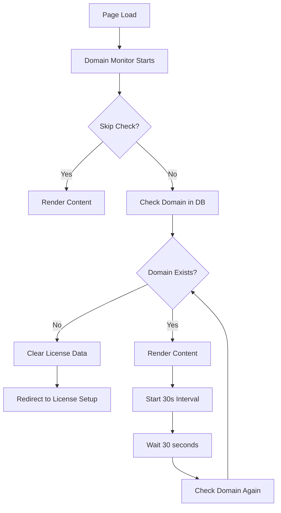

# Real-time Domain Verification System

## Overview
Implemented a comprehensive real-time domain verification system that continuously checks if the current domain exists in the admin panel's SAAS clients database every 30 seconds across the entire website.

## ✅ Task Completed

**Request**: Apply domain verification check across the rest of the website in layout or middleware, checking every 30 seconds if the current domain exists in the admin database.

## 🔧 Implementation

### 1. Domain Verification Monitor Component
**File**: `/src/components/DomainVerificationMonitor.tsx`

#### Features:
- ✅ **30-Second Interval Checks**: Automatic domain verification every 30 seconds
- ✅ **Initial Page Load Check**: Verifies domain immediately when page loads
- ✅ **Page Visibility Detection**: Checks domain when user returns to tab
- ✅ **Route-Based Exemptions**: Skips checks on debug/test pages
- ✅ **Immediate Response**: Redirects to license setup if domain not found
- ✅ **Network Error Handling**: Graceful handling of connection failures

#### Key Logic:
```typescript
// 30-second interval domain checking
const checkInterval = 30000; // 30 seconds

// Exempt routes where domain checking should be skipped
const exemptRoutes = [
  '/test-admin-connection',
  '/debug/',
  '/license-setup', 
  '/license-invalid',
  '/logout'
];

// Real-time domain verification
const performDomainCheck = async () => {
  const response = await fetch('/api/debug/check-domain', {
    method: 'POST',
    body: JSON.stringify({ domain: window.location.hostname })
  });
  
  if (!result.success || !result.result?.exists) {
    // Domain not found - immediate action
    router.push('/license-setup?error=domain_not_found');
  }
};
```

### 2. Layout Integration
**File**: `/src/app/layout.tsx`

Integrated domain verification monitor at the highest level:

```tsx
<DomainVerificationMonitor checkInterval={30000}>
  <LicenseGuard>
    <RealtimeLicenseCheck>
      {children}
    </RealtimeLicenseCheck>
  </LicenseGuard>
</DomainVerificationMonitor>
```

**Component Hierarchy**:
```
SessionProvider
└── ThemeProvider
    └── TooltipProvider
        └── CartProvider
            └── ChatProvider
                └── DomainVerificationMonitor ← NEW
                    └── LicenseGuard
                        └── RealtimeLicenseCheck
                            └── App Content
```

### 3. Enhanced License Setup Page
**File**: `/src/app/license-setup/page.tsx`

Added handling for domain verification errors:
- Detects `?error=domain_not_found` URL parameter
- Shows specific error message for unregistered domains
- Provides guidance to contact administrator

## 🎯 System Behavior

### Real-time Domain Verification Flow



### 1. Initial Page Load
- ✅ Domain verification runs immediately
- ✅ Shows loading screen during verification
- ✅ Blocks content until domain is verified

### 2. Continuous Monitoring (Every 30 Seconds)
- ✅ Background domain checks every 30 seconds
- ✅ No user interface disruption during checks
- ✅ Immediate action if domain becomes invalid

### 3. Page Visibility Detection
- ✅ Checks domain when user returns to tab/window
- ✅ Ensures verification even after long idle periods
- ✅ Prevents stale domain status

### 4. Route-Based Exemptions
**Skipped Routes**:
- `/test-admin-connection` - Domain testing page
- `/debug/*` - All debug pages
- `/license-setup` - License configuration
- `/license-invalid` - License error page
- `/logout` - Logout page

### 5. Error Handling
- **Network Errors**: Logs warning but continues (temporary issues)
- **Domain Not Found**: Immediate redirect to license setup
- **API Errors**: Graceful degradation with logging

## 🔄 Domain Verification Intervals

### Multiple Check Triggers:
1. **Page Load**: Immediate verification (0 seconds)
2. **Interval Timer**: Every 30 seconds
3. **Page Focus**: When user returns to tab
4. **Route Change**: When navigating to non-exempt pages

### Timing Examples:
- **T+0s**: Page loads → Domain check
- **T+30s**: First interval check
- **T+60s**: Second interval check
- **T+90s**: Third interval check
- **User switches tab and returns**: Immediate check if >30s since last

## 🚨 Domain Removal Response

When a domain is removed from the admin database:

### Immediate Actions (Within 30 seconds):
1. ✅ **Domain Check Fails**: API returns `exists: false`
2. ✅ **Clear License Data**: Remove all cached license information
3. ✅ **Redirect User**: Immediate redirect to `/license-setup?error=domain_not_found`
4. ✅ **Show Error Message**: Specific message about domain not being registered

### User Experience:
```
User browsing site → Admin deletes domain → Within 30 seconds → 
User redirected to license setup with error message
```

## 🔧 API Integration

Uses the existing domain verification API:
- **Client Route**: `/api/debug/check-domain`
- **Admin Route**: `/api/saas/check-domain`
- **Database Query**: Searches `saasClients` table

### Request Format:
```json
{
  "domain": "example.com"
}
```

### Response Format:
```json
{
  "success": true,
  "result": {
    "exists": true,
    "domain": "example.com",
    "client": { /* client details */ }
  }
}
```

## 🎨 User Interface

### Loading State (Initial Check):
```
┌─────────────────────────────────────┐
│  🔄  Verifying domain registration... │
│     Checking if example.com is       │
│           registered                 │
└─────────────────────────────────────┘
```

### Domain Not Found State:
```
┌─────────────────────────────────────┐
│  ⚠️  Domain Not Registered           │
│     This domain is not registered   │
│     in the admin panel as a SAAS    │
│     client.                         │
│     Redirecting to license setup... │
└─────────────────────────────────────┘
```

### Enhanced License Setup (Domain Error):
```
┌─────────────────────────────────────┐
│  ❌ This domain is not registered    │
│     in the admin panel. Please      │
│     contact your administrator to   │
│     register this domain as a       │
│     SAAS client.                    │
└─────────────────────────────────────┘
```

## 🛡️ Security & Performance

### Security Features:
- ✅ **No Sensitive Data Exposure**: Only checks domain existence
- ✅ **Immediate Response**: Quick action on domain removal
- ✅ **Cache Clearing**: Removes all license data when domain invalid

### Performance Optimizations:
- ✅ **Prevents Duplicate Checks**: Single check at a time using ref
- ✅ **Efficient Intervals**: Only runs when page is active
- ✅ **Route Exemptions**: Skips unnecessary checks on debug pages
- ✅ **Network Error Tolerance**: Continues on temporary failures

## 📊 Monitoring & Logging

### Console Logging:
```javascript
// Successful check
"Domain verification check: { domain: 'example.com', timestamp: '...' }"
"Domain verification: PASSED"

// Failed check
"Domain verification: FAILED - Domain not found in admin database"

// Network error
"Domain verification check failed: NetworkError"
"Domain verification network error - continuing with current session"
```

### Error Tracking:
- Domain verification failures logged
- Network errors tracked separately
- Redirect actions logged for debugging

## 🔄 Integration with Existing Systems

### Works Alongside:
- ✅ **License Guard**: Continues to verify license keys
- ✅ **Middleware**: Server-side license verification
- ✅ **Real-time License Check**: Client-side license monitoring

### Layered Security:
1. **Domain Verification**: Ensures domain is registered (NEW)
2. **License Verification**: Validates license key
3. **Middleware Protection**: Server-side route protection

## 🎯 Use Cases

### 1. Domain Removal Detection
**Scenario**: Admin removes domain from SAAS clients
**Result**: User redirected within 30 seconds

### 2. Domain Transfer Prevention
**Scenario**: Domain transferred to unauthorized party
**Result**: New domain not in database, access blocked

### 3. Configuration Drift Detection
**Scenario**: Domain configuration changes
**Result**: Immediate detection and user notification

### 4. Unauthorized Domain Usage
**Scenario**: Someone tries to use license on unregistered domain
**Result**: Domain check fails, access denied

## ✅ Testing Scenarios

### 1. Normal Operation
- ✅ Domain exists in database
- ✅ Checks run every 30 seconds
- ✅ No user disruption

### 2. Domain Removal
- ✅ Admin deletes domain from database
- ✅ Next check (≤30s) detects removal
- ✅ User redirected to license setup

### 3. Network Issues
- ✅ Temporary network failure
- ✅ System continues operating
- ✅ Resumes checking when network restored

### 4. Page Visibility
- ✅ User switches away from tab
- ✅ Returns after >30 seconds
- ✅ Immediate domain check performed

## 🚀 Benefits

✅ **Real-time Protection**: 30-second maximum exposure time
✅ **Comprehensive Coverage**: Monitors entire website
✅ **User-Friendly**: Smooth experience with clear error messages
✅ **Performance Optimized**: Minimal impact on user experience
✅ **Network Resilient**: Handles temporary connection issues
✅ **Debug-Friendly**: Skips checks on testing pages
✅ **Immediate Response**: Quick action on domain issues

## 📋 Configuration

The domain verification system is configurable:

```tsx
<DomainVerificationMonitor 
  checkInterval={30000}  // 30 seconds (customizable)
  skipCheck={false}      // Enable/disable entirely
>
  {children}
</DomainVerificationMonitor>
```

## 🎉 Result

The real-time domain verification system now provides:

- **Continuous monitoring** of domain registration status
- **30-second maximum response time** to domain removal
- **Seamless integration** with existing license verification
- **User-friendly error handling** with clear guidance
- **Performance-optimized** background checking
- **Debug-friendly** exemptions for testing pages

Users can no longer access the website if their domain is removed from the admin panel's SAAS clients database, with detection and response happening within 30 seconds!
